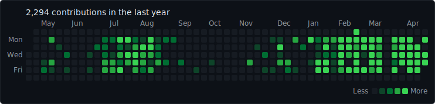

# GitLab Contribution Graph Generator

This project automatically generates a GitHub-style contribution graph from a private GitLab instance and displays it in this README.

### My GitLab Contributions



## How It Works

A GitHub Action runs daily, executing a Python script that fetches your GitLab contribution events from the last year. It then generates an SVG image mimicking the GitHub contribution graph and commits the updated SVG back to this repository.

## Setup

### Repository Secrets

To use this action, configure the following secrets in your GitHub repository under **Settings > Secrets and variables > Actions**:

-   `GITLAB_URL`: The base URL of your GitLab instance (e.g., `https://gitlab.com`).
-   `GITLAB_TOKEN`: A GitLab Personal Access Token with `read_user` scope.
-   `RUNNER_CHECK_TOKEN`: A fine-grained personal GitHub access token with repository administration read permissions to check runner status (see [here](https://docs.github.com/en/rest/actions/self-hosted-runners?apiVersion=2022-11-28#list-self-hosted-runners-for-a-repository) for more information).

### Self-hosted Runner

If your GitLab instance is on a private network or requires a VPN, the default GitHub-hosted runner will not be able to access it. You must use a [self-hosted runner](https://docs.github.com/en/actions/hosting-your-own-runners/about-self-hosted-runners) that is configured on a machine within that network - it can be your work laptop, a home server, etc.

The workflow file is already configured to use a `self-hosted` runner.

#### Self-hosted Runner Status Check

The workflow includes an automatic runner status check that verifies if your self-hosted runner is online before executing the build.

### Scheduled Runner Window (Optional)

Instead of running the self-hosted runner 24/7, you can use systemd timers to start it just before the workflow fires and stop it right after. The workflow runs daily at **12PM BRT (15:00 UTC)**.

1.  **Disable auto-start on boot:**
    ```bash
    sudo systemctl disable <RUNNER_SERVICE_NAME>
    ```

2.  **Create timer units** to start the runner at 11:45 and stop it at 12:30:

    `/etc/systemd/system/github-actions-runner-start.timer`:
    ```ini
    [Unit]
    Description=Start GitHub Actions runner before scheduled workflow

    [Timer]
    OnCalendar=11:45
    Persistent=true

    [Install]
    WantedBy=timers.target
    ```

    `/etc/systemd/system/github-actions-runner-start.service`:
    ```ini
    [Unit]
    Description=Start GitHub Actions runner for scheduled workflow

    [Service]
    Type=oneshot
    ExecStart=/usr/bin/systemctl start <RUNNER_SERVICE_NAME>
    ```

    `/etc/systemd/system/github-actions-runner-stop.timer`:
    ```ini
    [Unit]
    Description=Stop GitHub Actions runner after scheduled workflow

    [Timer]
    OnCalendar=12:30
    Persistent=false

    [Install]
    WantedBy=timers.target
    ```

    `/etc/systemd/system/github-actions-runner-stop.service`:
    ```ini
    [Unit]
    Description=Stop GitHub Actions runner after scheduled workflow

    [Service]
    Type=oneshot
    ExecStart=/usr/bin/systemctl stop <RUNNER_SERVICE_NAME>
    ```

    > Replace `<RUNNER_SERVICE_NAME>` with your runner's service name. Find it with: `ls /etc/systemd/system/actions.runner.*`

3.  **Enable the timers:**
    ```bash
    sudo systemctl daemon-reload
    sudo systemctl enable --now github-actions-runner-start.timer github-actions-runner-stop.timer
    ```

4.  **Verify:**
    ```bash
    systemctl list-timers github-actions-runner-*
    ```

    Adjust the `OnCalendar` times if you changed the workflow cron schedule.

### Local Development

To run the script locally for testing:

1.  **Create a nix shell:**
    ```bash
    nix-shell
    ```

2.  **Set environment variables:**
    ```bash
    export GITLAB_URL="<your_gitlab_instance_url>"
    export GITLAB_TOKEN="<your_gitlab_pat>"
    export RUNNER_CHECK_TOKEN="<your_fine_grained_token>"
    ```

3.  **Run the script:**
    ```bash
    python .github/scripts/gitlab_heatmap.py
    ```
