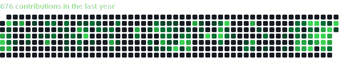

# GitLab Contribution Graph Generator

This project automatically generates a GitHub-style contribution graph from a private GitLab instance and displays it in this README.

### My GitLab Contributions



## How It Works

A GitHub Action runs daily, executing a Python script that fetches your GitLab contribution events from the last year. It then generates an SVG image mimicking the GitHub contribution graph and commits the updated SVG back to this repository.

## Setup

### Repository Secrets

To use this action, configure the following secrets in your GitHub repository under **Settings > Secrets and variables > Actions**:

-   `GITLAB_URL`: The base URL of your GitLab instance (e.g., `https://gitlab.com`).
-   `GITLAB_TOKEN`: A GitLab Personal Access Token with `read_api` scope.

### Local Development

To run the script locally for testing:

1.  **Create a nix shell:**
    ```bash
    nix-shell
    ```

2.  **Set environment variables:**
    ```bash
    export GITLAB_URL="<your_gitlab_instance_url>"
    export GITLAB_TOKEN="<your_gitlab_pat>"
    ```

3.  **Run the script:**
    ```bash
    python .github/scripts/gitlab_heatmap.py
    ```
